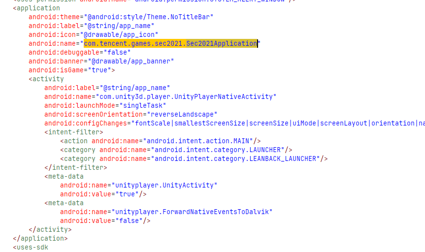
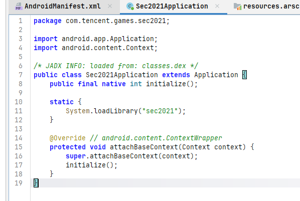
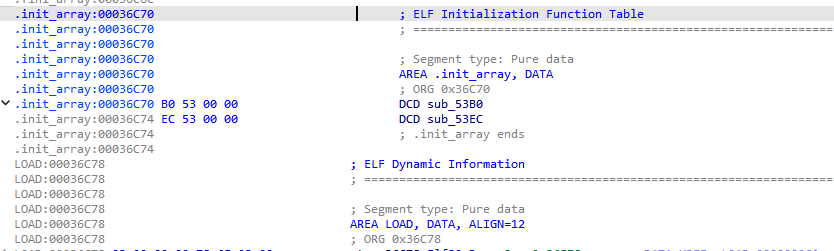
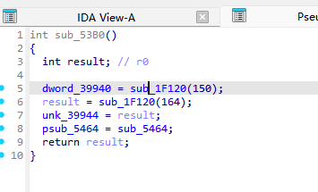
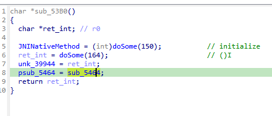

# Android初赛 实现游戏无敌的破解操作

感谢以下参考资料：
[https://www.cnblogs.com/bmjoker/p/11825679.html](https://www.cnblogs.com/bmjoker/p/11825679.html)

## 首先我们要了解Android apk的启动流程

---

### 1. Zygote进程

* 他是所有Android应用的父进程，当你打开App时他会自动fork自身完成ART虚拟机复制，可以做到类似java里父类公共属性可以提供给下面多态的子类使用，以此完成物理内存的共享
* 当你运行 `frida -f` 时，Frida 会在 Zygote fork 出子进程的一瞬间注入 `frida-agent.so`
* 然后执行 `ZygoteInit.main()` 通过反射找到 `ActivityThread` 类的 `public static void main(String[] args)` 静态方法

### 2. Activitythread启动

将内部用于 Binder 通信的代理对象ApplicationThread 注册给系统的 AMS（ActivityManagerService）

* 根据 `AndroidManifest.xml` 寻找application标签进行第一启动

## 其次我们要了解动态注册与静态注册

(动态注册优先于静态注册)

先讲解`JavaVM*`和`JNIenv*`概念

### JNIenv：

翻阅源代码可以知道JNIenv线程唯一

```c
struct JNIEnv {
    // 第一部分：函数表指针（所有线程共享）
    const struct JNINativeInterface* functions; // 这是那个"字典"
    
    // 第二部分：线程私有数据（看不见，虚拟机内部维护）
    void* thread_local_data; // 本地引用表、异常状态等
};

```

其中

```c
struct JNINativeInterface {
    void*   reserved0;      // 索引 0，偏移 0
    void*   reserved1;      // 索引 1，偏移 4
    void*   reserved2;      // 索引 2，偏移 8
    void*   reserved3;      // 索引 3，偏移 12
    ...
    jclass  (*FindClass)(JNIEnv*, const char*);  // 索引 6，偏移 24
    ...
    jint    (*RegisterNatives)(JNIEnv*, jclass, ...); // 索引 215，偏移 860
    ...
    jint    (*GetJavaVM)(JNIEnv*, JavaVM**);     // 索引 228，偏移 912
};

```

### JavaVM:

他不是转class那个vm,而是用于获取JNIenv的

```c
jint JNI_OnLoad(JavaVM* vm, void* reserved) {
    JNIEnv* env;
    (*vm)->GetEnv(vm, (void**)&env, JNI_VERSION_1_6);
    //  vm 是总机，用它的 GetEnv 拿到当前线程（主线程）的 env

    // ... 注册 native 方法 ...
    
    g_javaVM = vm;  // 把总机存起来，以后子线程要用
    return JNI_VERSION_1_6;
}

```

---

### 静态注册：

函数名固定为 Java_包名_类名_方法名，虚拟机自动匹配，不需要额外注册代码

**java层**

```java
package com.example.test;

public class MyClass {
    // 声明 native 方法
    public native String stringFromJNI();
}

```

**Native层**

```c
#include <jni.h>

// 函数名必须遵守：Java_包名_类名_方法名
// 注意：包名里的点换成下划线
JNIEXPORT jstring JNICALL
Java_com_example_test_MyClass_stringFromJNI(JNIEnv* env, jobject thiz) {
    return (*env)->NewStringUTF(env, "Hello from JNI");
}
//对以下语句的解释
(*env)->FindClass(env, "java/lang/String");

// 这句话拆开就是：
// 1. (*env)：拿到函数表入口（functions 指针）
// 2. ->FindClass：在函数表里找 FindClass
// 3. (env, "java/lang/String")：调用它，把 env 自己作为第一个参数传进去

```

当然JNI_Onload也是可选的，这是因为JNI_OnLoad 有两个功能

* **功能一（可选）**：动态注册方法。
* **功能二（必须）**：告诉虚拟机“我这个 so 需要哪个版本的 JNI”

```java
jint JNI_OnLoad(JavaVM* vm, void* reserved) {
    // 什么都不干，只告诉虚拟机我需要的 JNI 版本
    return JNI_VERSION_1_6;
}

```

即使你用的是静态注册（不需要手动绑定方法），虚拟机仍然会在加载 so 后找你有没有 JNI_OnLoad

* 如果有，就调用它，并根据你返回的版本号，决定用新版还是旧版的 JNI 函数表
* 如果没有，虚拟机就默认用最老的 JNI 1.1 版本

---

### 动态注册：

**java层**

```java
package com.example.test;

public class MyClass {
    public native String stringFromJNI();
    public native int add(int a, int b);
}

```

**Native层:**

```c
#include <jni.h>

// ========== native 实现函数（函数名任意） ==========
jstring native_string(JNIEnv* env, jobject thiz) {
    return (*env)->NewStringUTF(env, "Dynamic register success");
}

jint native_add(JNIEnv* env, jobject thiz, jint a, jint b) {
    return a + b;
}

// ========== JNI_OnLoad ==========
jint JNI_OnLoad(JavaVM* vm, void* reserved) {
    JNIEnv* env;
    if ((*vm)->GetEnv(vm, (void**)&env, JNI_VERSION_1_6) != JNI_OK) {
        return JNI_ERR;
    }

    jclass clazz = (*env)->FindClass(env, "com/example/test/MyClass");
    if (clazz == NULL) return JNI_ERR;

    JNINativeMethod methods[] = {
        {"stringFromJNI", "()Ljava/lang/String;", (void*)native_string},
        {"add",           "(II)I",                (void*)native_add}
    };


    if ((*env)->RegisterNatives(env, clazz, methods, 
                                sizeof(methods)/sizeof(methods[0])) < 0) {
        return JNI_ERR;
    }

    return JNI_VERSION_1_6;
}

```
关于JNINativeMethod的讲解：
```c
typedef struct {
    const char* name;       // Java 层的方法名
    const char* signature;  // 方法签名（参数和返回值类型）
    void*       fnPtr;      // 对应的 C/C++ 函数指针
} JNINativeMethod;
```


给出f5伪代码例子：

```c
jint JNI_OnLoad(JavaVM *vm, void *reserved)
{
  void *version; // r5
  jint ret_when_fail; // r6
  int env1; // r7
  int path_of_Sec2021Application; // r0
  int clasz; // r0
  int clasz_1; // r8
  int v10; // r0
  int env; // [sp+0h] [bp-20h] BYREF
//860 912等数字 都要除以4以表达在32位下的索引，64 位下指针大小变为 8 字节，偏移量除以 8 来计算索引
  useless();
  version = &::version;
  env = 0;
  ret_when_fail = -1;
  if ( !(*vm)->GetEnv(vm, (void **)&env, (jint)&::version) )
  {
    env1 = env;
    path_of_Sec2021Application = str(171);      // com/tencent/games/sec2021/Sec2021Application
    clasz = (*(int (__fastcall **)(int, int))(*(_DWORD *)env1 + 24))(env1, path_of_Sec2021Application);// env->FindClass(env, v6)
    if ( clasz && (clasz_1 = clasz, !(*(int (__fastcall **)(int))(*(_DWORD *)env1 + 912))(env1)) )// 判断失败与否
    {
      if ( (*(int (__fastcall **)(int, int, int *, int))(*(_DWORD *)env1 + 860))(env1, clasz_1, &jninativemethod, 1) >= 0 )
      {                                         // 860是registernative
        v10 = sub_14E80();
        if ( check(v10, vm, env) )
          return -1;
        return (jint)version;
      }
    }
    else
    {
      (*(void (__fastcall **)(int))(*(_DWORD *)env1 + 68))(env1);
    }
  }
  return ret_when_fail;
}

```

最后我们要了解Unity游戏启动层:

目前市面上有两种常见的Unity游戏打包法：

1.Mono

Unity 编辑器里选 Scripting Backend: Mono 时

有点类似ART,只是这里unity不需要用户们自己下载vm翻译，直接把Mono的RTvm也放apk里发过去了

此时你写的C# 脚本（PlayerController.cs、GameManager.cs），Unity 会把它们编译成 Assembly-CSharp.dll(IL)交付给Mono翻译

```
[ 安卓系统 (Android OS) ] 
       ↓
[ Unity 引擎层 (libunity.so) ]
       ↓
[ Mono 虚拟机层 (libmono.so) ] <--- 你可以 Hook 这里
       ↓
[ 托管代码层 (Assembly-CSharp.dll) ] <--- 你可以直接反编译这里
       ↓
[ JIT 编译器 ] -> [ 生成内存中的 ARM 指令 ] -> [ CPU 执行 ]
```

1.

```
[ 安卓系统 (Android OS) ] 
       ↓
zygote自己fork之后然后开了androidthread再反射一大堆然后到xml里<application>找到3Dunity然后stastic_load之类的找到
       ↓
[ Unity 引擎层 (libunity.so) ]
```

2.

[ Unity 引擎层 (libunity.so) ]

在 libunity.so 内部，引擎初始化完渲染、物理、音频等系统后，会调用 Mono 的初始化函数
       ↓
[ Mono 虚拟机层 (libmono.so) ] 

伪代码大概如下：
```cpp
// 在 libunity.so 内部
void InitMono() {
    // 1. 告诉 Mono 去哪找 dll 文件
    mono_set_dirs("/data/app/包名/lib", "/data/data/包名/files");
    
    // 2. 启动 Mono 运行时，创建主应用域
    MonoDomain* domain = mono_jit_init_version("UnityRootDomain", "v4.0.30319");
    
    // 3. 加载核心程序集
    MonoAssembly* assembly = mono_domain_assembly_open(domain, "Assembly-CSharp.dll");
    
    // 4. 把 Unity 引擎的底层能力注入给 Mono
    //    这样 C# 代码才能调用 transform.Translate() 之类的方法
    RegisterInternalCalls();
}
```
不信自己去ida随便开个libunity.so查一下mono_jit_init_version等字符串

链接器在生成 libunity.so 时，会把“我需要 libmono.so”这个信息写入 so 文件的 DT_NEEDED 段
当你调用 System.loadLibrary("unity") 后，dlopen 加载 libunity.so 时，会自动递归加载所有被依赖的 so
因此，libmono.so 是被系统自动拽进来的，不需要 Unity 写一行代码去主动加载

3.

[ Mono 虚拟机层 (libmono.so) ]

Mono 虚拟机找到并加载 Assembly-CSharp.dll，然后开始执行你写的游戏逻辑
       ↓
[ 托管代码层 (Assembly-CSharp.dll) ]

关键：

```c
MonoImage* mono_image_open_from_data_with_name(
    char *data,                  // 数据指针
    uint32_t data_len,           // 数据长度
    mono_bool need_copy,         // 是否让 Mono 内部复制一份数据
    MonoImageOpenStatus *status, // 输出加载状态（成功或错误类型）
    mono_bool refonly,           // 是否仅作为引用程序集加载
    const char *name             // 程序集名称，如 "Assembly-CSharp.dll"
);
```

Mono虚拟机通过mono_image_open_from_data_with_name函数加载dll到内存

最后dll交给JIT进行编译

2.il2cpp(Intermediate Language To C++)

IL2CPP 是 纯 AOT（提前编译），不存在“运行时加载 dll”这个概念

```
[ 安卓系统 (Android OS) ] 一样zygote流程
       ↓  加载
[ Unity 引擎层 (libunity.so) ] 
       ↓  引擎初始化时调用
[ IL2CPP 运行时 + 编译后的游戏代码 (libil2cpp.so) ]  <--- 你可以 Hook / 逆向这里
       ↓  内部启动时读取
[ 元数据文件 (global-metadata.dat) ]   <--- 配合 Il2CppDumper 可恢复类名、方法名
       ↓  运行时直接调用
[ 早已编译好的 ARM 机器指令 ]           <--- 没有 JIT，直接原生执行
       ↓
[ CPU 执行 ]
```


开始解题：

我们上来可以发现是Mono打包的游戏，看了看Assembly-CSharp.dll却是加密的，并且我们在AndroidManifest.xml可以看到启动点和Unity类似物

于是我想的是直接frida hook了,拿参数然后看逻辑就行，结果有frida反调试，先处理过检测



跟进得到

    

那么就是这里进入了native层

ida打开libsec2021.so追踪init_array



追第一个函数



可以发现是一个字符串解密类函数，以argv为起始索引，并存在特定的keytable

甩给deepseek可以得到解密脚本，这里以后也是一个思路，可以让字符串作为注释附上

```
"""
IDAPython 脚本：自动解析 doSome 调用的字符串并添加注释
支持 MOV, MOVS, MOVW+MOVT, LDR, ADR 等常见 R0 赋值模式
"""

import idautils
import idc
import idaapi

# ---------- 配置 ----------
BASE_372A8 = 0x372A8          # byte_372A8 起始地址
BASE_KEY   = 0x34EB7          # 密钥表 unk_34EB7 起始地址
KEY_LEN    = 17

# ---------- 密钥表读取 ----------
def read_key_table():
    """从密钥表读取 17 字节循环密钥"""
    return [idc.get_wide_byte(BASE_KEY + i) for i in range(KEY_LEN)]

# ---------- 解密函数 ----------
def decrypt_payload(a1):
    """模拟 doSome 解密流程，返回解密出的可读字符串或字节表示"""
    v5 = idc.get_wide_byte(BASE_372A8 + a1)          # 包头第 0 字节
    v8 = idc.get_wide_byte(BASE_372A8 + a1 + 1)      # 包头第 1 字节
    n3 = v8 ^ v5                                      # 有效载荷长度

    if n3 == 0:
        return ""

    key = read_key_table()
    decrypted = bytearray()
    for i in range(n3):
        enc_byte = idc.get_wide_byte(BASE_372A8 + a1 + 2 + i)
        dec_byte = enc_byte ^ v5 ^ key[i % KEY_LEN]
        decrypted.append(dec_byte)

    # 尝试显示为可读字符串，若含非打印字符则用 repr 形式
    try:
        s = decrypted.decode('latin-1')
        if not all(32 <= ord(c) < 127 or c in '\n\r\t' for c in s):
            s = repr(decrypted)
    except:
        s = repr(decrypted)
    return s

# ---------- 增强的 R0 值提取 ----------
def extract_arg_a1(call_ea, max_back=64):
    """
    从 call_ea 向前回溯，提取 doSome 的参数 a1 (R0 的值)。
    支持:
      MOV/MOVS R0, #imm
      MOVW/MOVT 组合
      LDR R0, =const / LDR R0, [PC, #off]
      ADR R0, label
    """
    ea = call_ea
    for _ in range(max_back):
        ea = idc.prev_head(ea)
        if ea == idc.BADADDR:
            break

        mnem = idc.print_insn_mnem(ea).upper()
        # 只处理写入 R0 的指令
        if idc.get_operand_type(ea, 0) != 1:  # o_reg
            continue
        if idc.get_operand_value(ea, 0) != 0: # 不是 R0
            continue

        # --- 1. MOV / MOVS 立即数 ---
        if mnem in ('MOV', 'MOVS'):
            if idc.get_operand_type(ea, 1) == idc.o_imm:
                val = idc.get_operand_value(ea, 1)
                # MOVS 可能会更新标志，但值不变
                return val & 0xFFFFFFFF

        # --- 2. MOVW (可能后跟 MOVT) ---
        elif mnem == 'MOVW':
            if idc.get_operand_type(ea, 1) == idc.o_imm:
                val_low = idc.get_operand_value(ea, 1) & 0xFFFF
                next_ea = idc.next_head(ea)
                if idc.print_insn_mnem(next_ea).upper() == 'MOVT':
                    if (idc.get_operand_type(next_ea, 0) == 1 and
                        idc.get_operand_value(next_ea, 0) == 0 and
                        idc.get_operand_type(next_ea, 1) == idc.o_imm):
                        val_high = idc.get_operand_value(next_ea, 1) & 0xFFFF
                        return (val_high << 16) | val_low
                # 若没有 MOVT，只返回低位（可能不是完整地址，但极少见）
                return val_low

        # --- 3. LDR R0, =const 或 LDR R0, [PC, #...] ---
        elif mnem == 'LDR':
            op1_type = idc.get_operand_type(ea, 1)
            if op1_type == idc.o_imm:      # 形如 LDR R0, =0x12345678
                return idc.get_operand_value(ea, 1) & 0xFFFFFFFF
            elif op1_type == idc.o_mem:    # LDR R0, [PC, #off]
                addr = idc.get_operand_value(ea, 1)
                if addr and idaapi.is_loaded(addr):
                    return idc.get_wide_dword(addr)

        # --- 4. ADR / ADRL 伪指令 ---
        elif mnem in ('ADR', 'ADRL'):
            if idc.get_operand_type(ea, 1) == idc.o_imm:
                return idc.get_operand_value(ea, 1) & 0xFFFFFFFF

        # 其他情况暂不处理（如 LDR R0, [Rx, #off] 需要追踪 Rx）

    return None

# ---------- 主流程 ----------
def main():
    func_name = "doSome"
    doSome_ea = idc.get_name_ea_simple(func_name)
    if doSome_ea == idc.BADADDR:
        print(f"[-] 未找到函数 {func_name}，请检查函数名。")
        return

    success = 0
    failed  = 0

    for xref in idautils.XrefsTo(doSome_ea):
        # 只关心代码调用
        if xref.type not in (idaapi.fl_CN, idaapi.fl_CF):
            continue
        call_addr = xref.frm

        a1 = extract_arg_a1(call_addr)
        if a1 is None:
            idc.set_cmt(call_addr, "doSome: R0 未能静态解析", 0)
            print(f"[!] 0x{call_addr:X}: 无法解析 R0")
            failed += 1
            continue

        try:
            plain = decrypt_payload(a1)
        except Exception as e:
            plain = f"解密异常: {e}"
            print(f"[!] 0x{call_addr:X}: 解密时出错 - {e}")

        cmt = f'doSome 解密: "{plain}"'
        idc.set_cmt(call_addr, cmt, 0)
        print(f"[+] 0x{call_addr:X}: a1={a1} -> {plain}")
        success += 1

    print(f"\n[*] 完成。成功 {success} 处，失败 {failed} 处。")

if __name__ == "__main__":
    main()
```



改完名字后感觉像不像JNINativeMethod

那我们就直接看sub_5464(initialize)就好

由于java层给出的信息只有这个initialize，所以我们继续看，要记住我们的目的是过检测

直接在汇编页面寻找一下frida被检测的出现的字符串"hack detected" 追到kill函数中

nop掉kill函数那一串即可，写回重打包即可完成过检测

利用frida-hook得出解密后的so，查一下mono_image_open_with_name，发现多了一条跳转

ida动调可以发现追到libsec.so的0x1D29C函数

由于 mono_image_open_from_data_with_name函数的第一条指令会完成解密操作，所以可以hook下一条指令（此时已完成解密），当读取到真正的Assembly-CSharp.dll时（通过大小判断），将其dump出来

最后dll小改就实现了

题外话：

c/cpp是完全一端负责的，不具有平台适应性，jvm/apk是两端配合的，开发者负责写代码生成中间件，中间件交付给他人使用时由其JVM/(DVM/ART)适配

AS开发是把java由java->class->dex再分发

apk打包流程如下


jvm是虚拟机，它可以根据当前环境适配所有.class

开发者电脑上： 只负责把源码用 javac 编译成统一的 .class 字节码（比如打包成 .jar）

用户/服务器电脑上： JVM 接盘，现场读取 .class 并适配当前系统的硬件指令集

对于apk

开发者电脑上：

先用编译器把源码变成 .class

多走一步： 紧接着在电脑上用 d8/R8 工具把散落的 .class 揉碎、裁剪、合并，变成 .dex 字节码，并打包进 APK

用户手机上： DVM / ART 接盘，现场读取 .dex 并适配当前手机的移动端芯片指令集
