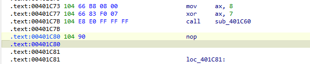
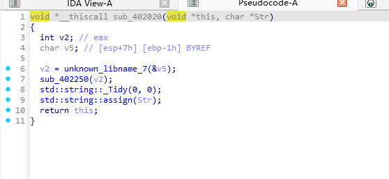
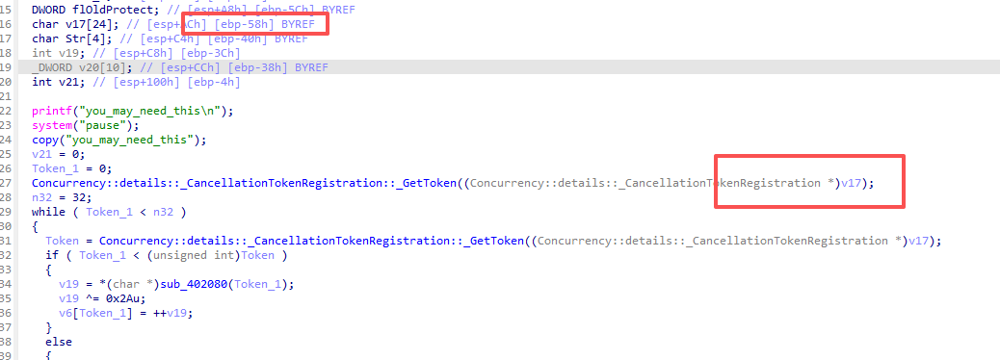
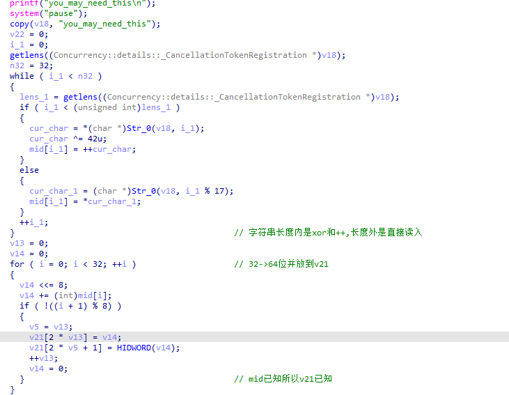
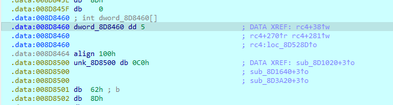
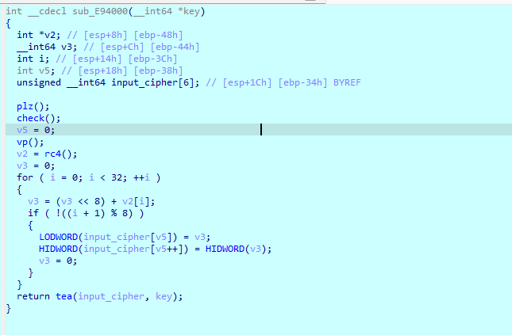
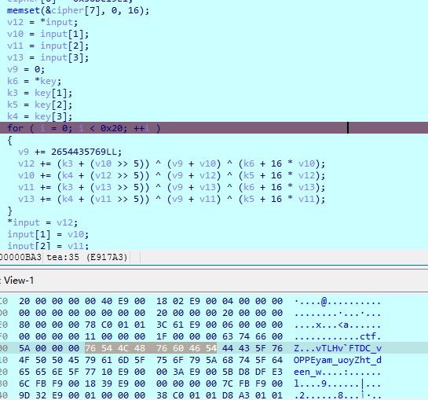

# LittleJunk(DASCTF)

## Solution:

### 首先进来到main函数看到三种花指令特征:

第一种是jmp到中间段不多说直接nop加u+c就行

第二种是`call`+`add     esp, 4`的花指令

由于call==jmp+push

它会计算绝对地址并将返回地址push到栈中作为ret点

而add esp 4是针对32位程序的栈的类似pop，直接抛去了栈顶元素

但是如图



我们`call sub_401C60`后一条指令是`nop`，根本也不是有用指令

所以其实就是`jmp to sub_401C60`+`push 00401C7B`但是`add     esp, 4`又把栈上的00401C7B返回地址吞了，而且这里根本没有`ret`指令去返回，所以处理方法就是`patching call(E8) -> jmp(E9)` 并 nop `add esp 4`即可

第三种是jz jnz 全nop就行，不过只有当跳转目标紧跟在花指令后面时才这样，不然的话自己改jmp

改完看`sub_402020`函数:



Tidy和assign还返回this那比较明显是拷贝赋值类似物

配合汇编发现v17是copy返回对象

下面懒得说了根据结构猜测就行，改名得出：



上面直接顺着就能求出由str带来的v21(key)

下面显然是SMC，上动调：给`sub_8D1EC0`下个断点f7一次就行

发现里面又有一个SMC啊没事我们输入试探flag:`flag{aaaaaaaaaaaaaaaaaaaaaaaaaaaaaaaa}`

然后跑一次rc4即`sub_8D5000`



这里出个坑啊我们知道`dword_8D8460`肯定是32大小的嘛，但是这里只有一个dd是咋回事

这说明是align的辅助分析错误，对align `undefined`一下就看见了

这时候我们发现`Sbox`的形成不由flag组成的，所以我们可以根据`dword_8D8460`的结果反向推出异或流
```python
keystream = [
    100, 59, 121, 167, 82, 46, 175, 226, 54, 205, 146, 92, 30, 106, 69, 100,
    13, 1, 111, 178, 126, 196, 155, 138, 56, 2, 89, 110, 151, 118, 35, 196
]
```

然后动调配合稍微改一改花指令得出完整的`sub_E94000`:



rc4直接用xor盒解就行，key的话你可以dump内存也可以静态分析自己求

至于中间这一段就是转大端序而已，无所谓的

不过dump的话记得key是小端序



所以整体逻辑就是input -> xor -> tea ->cmp

直接逆回来就行

```python

keystream = [
    100, 59, 121, 167, 82, 46, 175, 226, 54, 205, 146, 92, 30, 106, 69, 100,
    13, 1, 111, 178, 126, 196, 155, 138, 56, 2, 89, 110, 151, 118, 35, 196
]

v12 = 0xE990A522BE80F786
v10 = 0x8B836286B8A5EB59
v11 = 0x2FDE61CCEFC70FF8
v13 = 0x56BC19E119C8B07B

v6 = 0x54466076484c5476
v3 = 0x4550504f765f4344
v5 = 0x5a796f755f6d6179
v4 = 0x5f6e6565645f7468


MASK64 = 0xFFFFFFFFFFFFFFFF
sum_val = 0x13C6EF3720  # 32轮累加的最大值
delta = 0x9E3779B9

for _ in range(32):
    # 按照 v13 -> v11 -> v10 -> v12 的完全反向顺序剥茧


    # 倒带行 4
    v13 = (v13 - (((v11 << 4) + v5) ^ (v11 + sum_val) ^ ((v11 >> 5) + v4))) & MASK64

    # 倒带行 3
    v11 = (v11 - (((v13 << 4) + v6) ^ (v13 + sum_val) ^ ((v13 >> 5) + v3))) & MASK64

    # 倒带行 2
    v10 = (v10 - (((v12 << 4) + v5) ^ (v12 + sum_val) ^ ((v12 >> 5) + v4))) & MASK64

    # 倒带行 1
    v12 = (v12 - (((v10 << 4) + v6) ^ (v10 + sum_val) ^ ((v10 >> 5) + v3))) & MASK64

    # 这轮减完了，解密时间线往前倒退一轮
    sum_val = (sum_val - delta) & MASK64

cc1 = [v12, v10, v11, v13]

temp = b""
for val in cc1:
    temp += val.to_bytes(8, byteorder='big')

# 异或 XOR 盒，吐出 Flag
flag = ""
for i in range(len(temp)):
    flag += chr(temp[i] ^ keystream[i])

print("最终解密出的 Flag 为")
print(flag)
```

最后得出flag{4a5c0f1b5cc7f60e918611721c87ba07}


