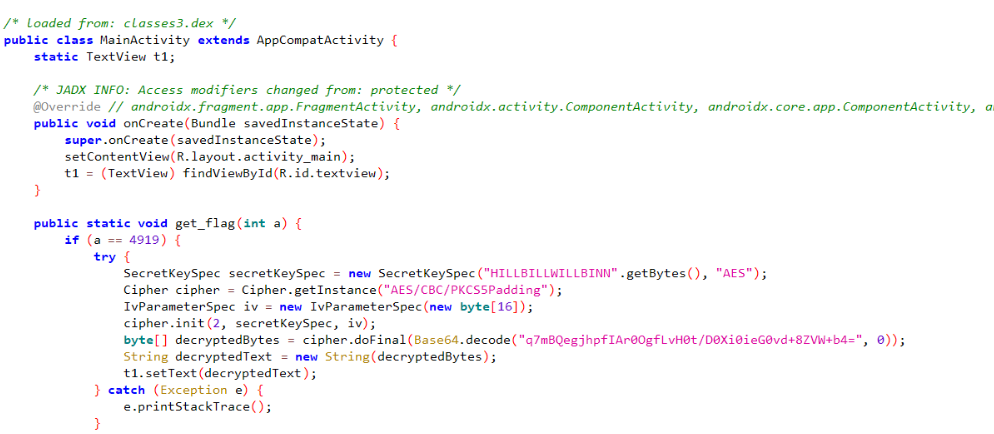
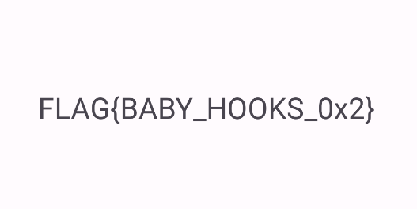
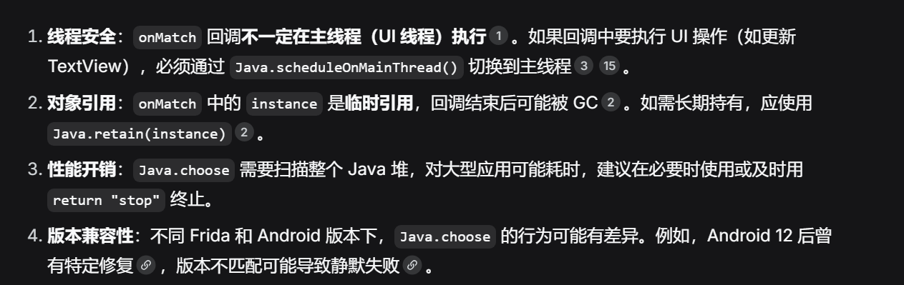
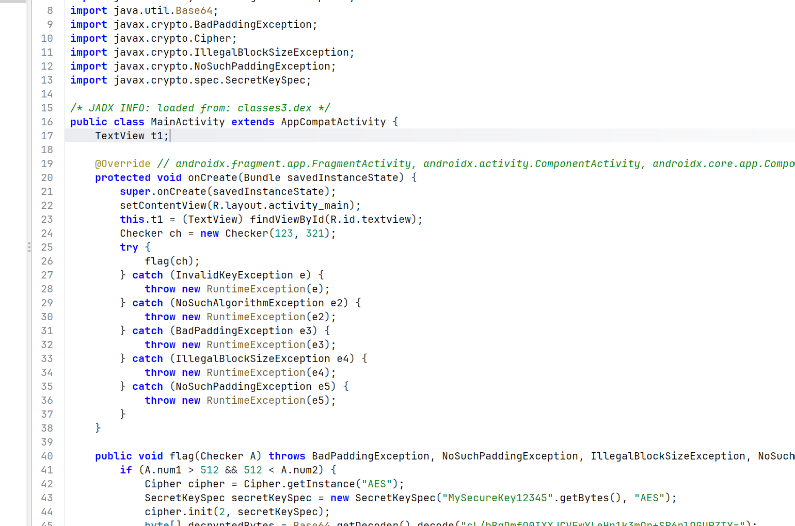

# Frida Baby Hook Learning Journey

## day 1(2026.06.27)

第一天主要学了怎么启动`frida-server`并连接到Root的device上吧

我使用的是雷电模拟器，打开adb调试并root之后在powershell内执行

```bash
adb shell getprop ro.product.cpu.abi
```
通过 Android 调试桥(ADB)来获取系统属性

这里我获得的是`x86_64`


然后去[https://github.com/frida/frida/releases](https://github.com/frida/frida/releases)寻找对应的release


解压后拿到`frida-server-17.10.1-android-x86_64`完成准备工作

然后在powershell中执行
```bash
adb push /path1/frida-server /path2
```


这是因为adb是作为中间层连接Android系统和PC端的，且在 Android 系统中，/data/local/tmp 是一个极为特殊的目录，它允许我们把具有可执行权限的文件（比如 frida-server）放进去并运行

推完后进入`adb shell`，给自己提一下权，切到`/data/local/tmp`下给`frida-server-17.10.1-android-x86_64`权限，然后运行


这时候再新开一个powershell执行`frida-ps -Uai`获取进程确认是否连接成功即可完成连接

## Homework of day 1

打开Subjects下`Challenge1.apk`并用jadx反编译

找到关键逻辑MainActivity


#### 很显然我们有两种hook方法

### Solution1

通过hook `get_random()` 获得一个固定值i 再输入对应的i2来解决

编写脚本之前我们先来看看template:
```js
Java.perform(function(){
    var YourClass = Java.use(path);
    YourClass.Method.implementation=function(<args>){
        /*
          UR IMPLEMENTATION OF THE METHOD
        */
    }
})
```
##### 然后介绍一下`Java.perform`,`Java.use`,`implemention`,`overload`的差别

1.`Java.perform`:
    主要作用:线程附加
    由于脚本注入时 App 进程刚创建，JVM可能还没启动完毕
    而Java.perform 会一直等待VM初始化完成,自动将当前线程附加到VM
    且就算JVM启动完了，脚本执行的线程不一定被 VM 认为是“Java 线程”
    所以用`Java.perform()`附加线程,也就是说如果是`native`层的hook则不需要这一步
2.`Java.use(className)`:
    获取指定 Java 类的 包装对象,通过这个对象可以访问该类的静态字段、静态方法，以及为实例方法设置 Hook
    要求className 是完整的类名，如 "android.app.Activity"
3.`implemention`:
这是方法替换的入口,为某个方法指定 implementation 属性并赋值为一个 JavaScript 函数后，原始 Java 方法就会被这个 JS 函数替换
4.`overload`:
处理 Java 方法的重载,因为 Java 中同名方法可能有多个不同参数版本，Frida 无法仅通过方法名自动确定你要 Hook 哪一个,用 .overload('参数类型1', '参数类型2', ...) 可以精确指定要修改的重载版本，指定的参数是用于匹配指定方法

#### 方法一解法如下
```js
Java.perform(function(){
    var target = Java.use("com.ad2001.frida0x1.MainActivity");
    target.get_random.implementation = function() {
        var result = this.get_random();
        console.log("Original result: " + result);
        return 1; // Modify the return value to 1
    }
});
```
##### 执行流程

```bash
frida -U -f com.ad2001.frida0x1
```

如果不加 -f，如-n（进程名）或 -p（PID）则会附加到一个已经在运行的进程


但是我们直接注入发现输入1*2+4没用啊,这是为什么呢?

我们回去看`jadx`可知：


`get_random()`处于`OnCreate()`中,这说明我们要在App进程创建的同时注入

所以这里应该用的注入法是
```bash
frida -U -f com.ad2001.frida0x1 -l ./Desktop/script.js
```
然后输入`Ans=6`即可


### Solution2

我们可以尝试hook`check()`函数如下:
```js
Java.perform(function() {
  var a = Java.use("com.ad2001.frida0x1.MainActivity");
  a.check.overload('int', 'int').implementation = function(a, b) {
    this.check(4, 12);
  }
});
```
来达到目的

### Homework of day 2

打开Subjects下`Challenge2.apk`并用jadx反编译



这里不是在`OnCreate()`里,注意注入时机即可

```js
Java.perform(function(){
    var t= Java.use("com.ad2001.frida0x2.MainActivity");
    t.get_flag.implementation= function(a){
        this.get_flag(4919);
    }
})
```
欸?不起作用?为什么呢？

#### 分析

这是因为`Java.perform`是被动的拦截，而这里的静态方法根本没人去调用，我们的脚本只能一直等......
```js
Java.perform(function(){
    var t= Java.use("com.ad2001.frida0x2.MainActivity");
    t.get_flag(4919);
})
```
改成这样主动寻找一次`get_flag()`就行,`implementation`是拦截时执行所写方法，我们这里不用换直接输入参数就行



### Homework of day 3

比较简单，存在比较明显的hook点，不再赘述

 

跟随找到`Checker`类


由于需要`Checker.code==512`所以我们应该去hook掉一开始的`code=0`

```js
Java.perform(function(){
  var Checker = Java.use("com.ad2001.frida0x3.Checker");
  Checker.code.value=512;
});
```
`increase()`没被调用过不必理会

```js
Java.perform(function(){
  var Checker = Java.use("com.ad2001.frida0x3.Checker");
  console.log("code is now: " + Checker.code.value);
  Checker.increase.implementation=function(){
    this.code.value+=512;
    console.log("code is now: " + Checker.code.value);
  }
  Checker.increase();
});
```

但是直接使用脚本会出问题，为什么呢，这是因为
Java 类是懒加载的
Checker 只在 onClick 里被用到，不点按钮，应用自己的 PathClassLoader 就不会去加载它
这时你用frida script可能通过当前可用的 ClassLoader（有时不是最终的那个）先加载了一份。改的是这份提前加载出来的副本

### Homework of day 4

```js
Java.perform(function() {

  var check = Java.use("com.ad2001.frida0x4.Check");
  var check_obj = check.$new(); // Class Object
  var res = check_obj.get_flag(1337); // Calling the method
  console.log("FLAG " + res);

})
```

对于非静态方法的hook调用要先声明，即使用`class.$new()`

### Homework of day 5


对于主线程`Mainactivity`不要尝试再次实例化

AI如是说：

你别用 $new() 去造一个 MainActivity 出来，这东西是系统生成的，你硬造一个‘假货’，它缺胳膊少腿（没上下文、没界面线程），一调用方法必崩

在 Frida 中，对现有实例调用方法很容易。为此，我们将使用两个 API：

Java.performNow：一个用于在 Java 运行时上下文中执行代码的函数。

Java.choose：在运行时找到指定 Java 类的实例

给出template:

```js
Java.performNow(function() {
  Java.choose('<Package>.<class_Name>', {
    onMatch: function(instance) {
      // TODO
    },
    onComplete: function() {}
  });
});
```

```js
Java.performNow(function() {
  Java.choose('com.ad2001.frida0x5.MainActivity', {
    onMatch: function(instance) {
      console.log("Instance found");
    },
    onComplete: function() {}
  });
});
```

最后我的脚本是

```js
Java.perform(function() {
  Java.choose('com.ad2001.frida0x5.MainActivity', {
    onMatch: function(instance) {
      Java.scheduleOnMainThread(function() {//
        instance.flag(1337);
      });
      return "stop";
    },
    onComplete: function() {}
  });
});

```

Java.choose() 会在内存里扫描所有存活的对象。如果当前 Activity 有多个实例（比如内存泄漏、或者开了多个界面），onMatch 就会被调用多次。

不写 return "stop"：Frida 会继续扫描堆内存，把所有 MainActivity 实例都找出来，并依次执行你的代码。

写了 return "stop"：Frida 找到第一个匹配的实例后，立刻停止扫描，不再继续找后面的，这里应该是运气好？

Java.scheduleOnMainThread(callback)：用于切换线程。它确保回调在 UI 线程执行，但它是异步的



### Homework of day 6

结构体类hook

```js
Java.perform(function(){
    var Checker = Java.use("com.ad2001.frida0x6.Checker");  // 改1：var check → var Checker
    var a = Checker.$new();                                 // 改2：class a → var a
    a.num1.value=1234;
    a.num2.value=4321;
    Java.choose('com.ad2001.frida0x6.MainActivity',{
        onMatch: function(instance){
           instance.get_flag(a);
           return "stop";
        },
        onComplete: function(){}
    });
});

 ```

### Homework of day 7




易知我们要创建一个新结构体的实例

```js
Java.perform(function(){
    var Checker = Java.use("com.ad2001.frida0x7.Checker");
    var a = Checker.$new(520,520);                                 
    Java.choose('com.ad2001.frida0x7.MainActivity',{
        onMatch: function(instance){
           instance.flag(a);
           return "stop";
        },
        onComplete: function(){}
    });
});

```


### Homework of day 8


改名zip后找到lib文件夹找一下`frida0x8`


涉及`native`层的一道题，易知静态注册

很显然的我们需要使得`res==1`，即使`v4==0`

但是我们回看jadx可以知道成功后并不是输出flag而是输出我们的输入

所以我们需要的是打印用来cmp的参数，分析`native`层，易知s2是被对比的参数

所以我们考虑利用onEnter获取属性值即可

但是首先我们要找到这个函数嘛，这里可以利用我们自己指定的str去匹配(因为我们定位的是strcmp嘛，一个apk不可能只有这个strcmp)

对于不涉及java层的hook我们不需要java.perform，用到的是`Interceptor.attach()`，但是这个函数的参数是一个内存地址，所以我们要找到strcmp的地址才行

然后`strcmp`是在`lib.so`里面的，以下学习一下`Frida`中的查找内存地址类的`api`


const m=Process.enumerateModules().find(m=>m.name === "libc.so");
或者
const m=Process.getModuleByName("libc.so")

var addr=m.findExportByName("strcmp")

```js
const m = Process.getModuleByName("libfrida0x8.so");  // 目标模块，不是 libc

const strcmp_adr = m.findExportByName("strcmp");
Interceptor.attach(strcmp_adr, {
    onEnter: function (args) {
        var arg0 = args[0].readUtf8String();  // 直接用 NativePointer 方法，兼容性更好
        var arg1 = args[1].readUtf8String();
        if (arg0 === "Hello") {               // 严格全等，不是 includes
            console.log("Hookin the strcmp function");
            console.log("Input " + arg0);
            console.log("The flag is " + arg1);
        }
    },
    onLeave: function (retval) {
        // Modify or log return value if needed
    }
});
```


### Homework of day 9

```java
const m = Process.enumerateModules().find(m => m.name === "liba0x9.so");
if (m) {
    // 找到 check_flag 函数
    const checkFlagAddr = m.findExportByName("Java_com_ad2001_a0x9_MainActivity_check_1flag");
    if (checkFlagAddr) {
        Interceptor.attach(checkFlagAddr, {
            onLeave(retval) {
                // 强制返回 1337，触发解密
                retval.replace(ptr(1337));
            }
        });
        console.log("check_flag hooked!");
    }
}
```

### Homework of day A

不知道为什么雷电模拟器写不了这题，版本太低了可能


追到`native`层可以发现有个没被调用过的`get_flag(int,int)`

`xrefs`表示没有被调用过,所以我们要自己主动调用一次

下面来学习主动调用类api
```js
var native_adr = new NativePointer(<address_of_the_native_function>);
const native_function = new NativeFunction(native_adr, '<return type>', ['argument_data_type']);
native_function(<arguments>);
```
就是先利用NativePointer取得地址再用而已，或者利用`findExportByName`

```js
var m = Process.enumerateModules().find(m => m.name === "liba0xa.so");
if (!m) {
    console.log("[-] Module not found");
} else {
    var get_flag_adr = m.findExportByName("get_flag");
    if (!get_flag_adr) {
        console.log("[-] get_flag not exported");
    } else {
        var get_flag = new NativeFunction(get_flag_adr, 'uint64', ['int', 'int']);
        get_flag(1, 2);
        console.log("[+] Called get_flag(1,2)");
    }
}

```
ida中so基址默认加载到0x0，Ghidra加载到0x10000来着，寻找偏移来写的话注意一下，再用
`var getFlagAddr = module.base.add(offset)`得到地址

### Homework of day B

涉及对执行流的`patch`

基本模板:
```js
var writer = new X86Writer(<instruction_address>);

try {
  // 插入指令

  // 将修改刷入内存
  writer.flush();

} finally {
  // 释放 X86Writer 资源
  writer.dispose();
}
```
看指令
```asm
        00020e1c c7  45  f0       MOV        dword ptr [EBP  + local_14 ],0xdeadbeef
                 ef  be  ad  de
        00020e23 81  7d  f0       CMP        dword ptr [EBP  + local_14 ],0x539
                 39  05  00  00
        00020e2a 0f  85  d8       JNZ        LAB_00020f08
                 00  00  00
```
我们可以尝试`patch JNZ` 化为`JE`

直接在ida找到JNZ第二个字节就行

但是我们尝试写入一块没有写权限的内存。我们要修改的是二进制文件的 .text 段，该段默认不具备写权限

要先利用`Memory.protect(address, size, protection);`改一下`rwx`获取权限

```js
var moduleName = "libfrida0xb.so";
var jnzOffset = 0x170CE;

var base = Module.getBaseAddress(moduleName);
var jnzAddr = base.add(jnzOffset);


Memory.protect(jnzAddr, 2, 'rwx');


jnzAddr.writeByteArray([0x0F, 0x84]);

console.log("[+] Patched JNZ -> JE");
console.log("[*] Click the button and check logcat for the flag");
```
即可解决


