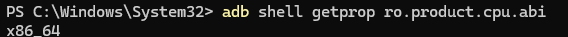
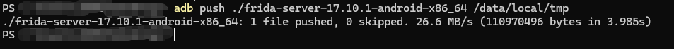
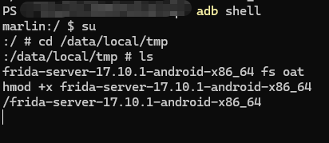
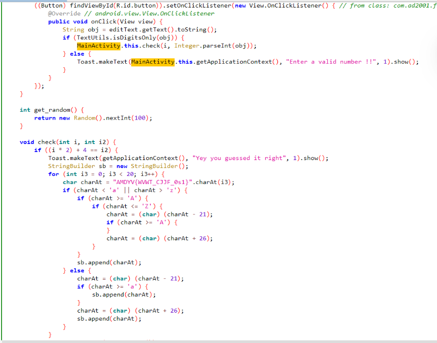
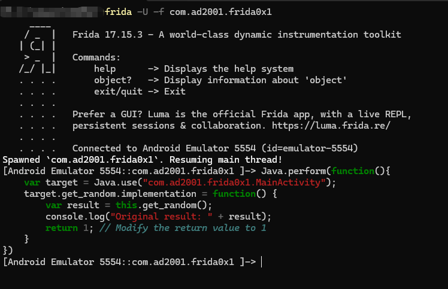
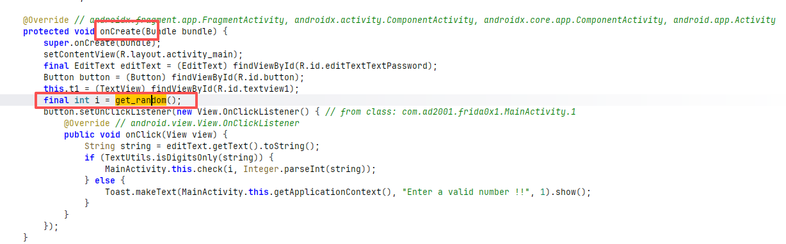
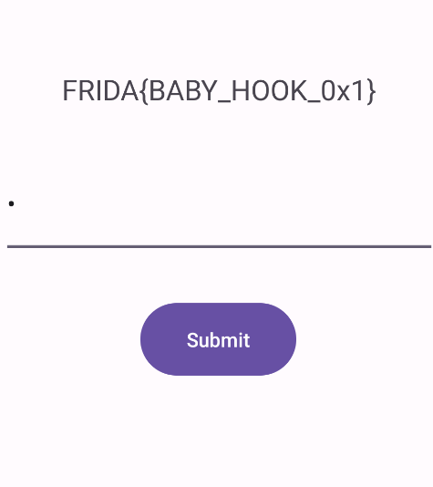

# Frida Baby Hook Learning Journey

## day 1(2026.06.27)

第一天主要学了怎么启动`frida-server`并连接到Root的device上吧

我使用的是雷电模拟器，打开adb调试并root之后在powershell内执行

```bash
adb shell getprop ro.product.cpu.abi
```
通过 Android 调试桥(ADB)来获取系统属性

这里我获得的是`x86_64`



然后去[https://github.com/frida/frida/releases](https://github.com/frida/frida/releases)寻找对应的release


解压后拿到`frida-server-17.10.1-android-x86_64`完成准备工作

然后在powershell中执行
```bash
adb push /path1/frida-server /path2
```


这是因为adb是作为中间层连接Android系统和PC端的，且在 Android 系统中，/data/local/tmp 是一个极为特殊的目录，它允许我们把具有可执行权限的文件（比如 frida-server）放进去并运行

推完后进入`adb shell`，给自己提一下权，切到`/data/local/tmp`下给`frida-server-17.10.1-android-x86_64`权限，然后运行



这时候再新开一个powershell执行`frida-ps -Uai`获取进程确认是否连接成功即可完成连接

## Homework of day 1

打开Subjects下`Challenge1.apk`并用jadx反编译

找到关键逻辑MainActivity



#### 很显然我们有两种hook方法

### Solution1

通过hook `get_random()` 获得一个固定值i 再输入对应的i2来解决

编写脚本之前我们先来看看template:
```js
Java.perform(function(){
    var YourClass = Java.use(path);
    YourClass.Method.implementation=function(<args>){
        /*
          UR IMPLEMENTATION OF THE METHOD
        */
    }
})
```
##### 然后介绍一下`Java.perform`,`Java.use`,`implemention`,`overload`的差别

1.`Java.perform`:
    主要作用:线程附加
    由于脚本注入时 App 进程刚创建，JVM可能还没启动完毕
    而Java.perform 会一直等待VM初始化完成,自动将当前线程附加到VM
    且就算JVM启动完了，脚本执行的线程不一定被 VM 认为是“Java 线程”
    所以用`Java.perform()`附加线程
2.`Java.use(className)`:
    获取指定 Java 类的 包装对象,通过这个对象可以访问该类的静态字段、静态方法，以及为实例方法设置 Hook
    要求className 是完整的类名，如 "android.app.Activity"
3.`implemention`:
这是方法替换的入口,为某个方法指定 implementation 属性并赋值为一个 JavaScript 函数后，原始 Java 方法就会被这个 JS 函数替换
4.`overload`:
处理 Java 方法的重载,因为 Java 中同名方法可能有多个不同参数版本，Frida 无法仅通过方法名自动确定你要 Hook 哪一个,用 .overload('参数类型1', '参数类型2', ...) 可以精确指定要修改的重载版本

#### 方法一解法如下
```js
Java.perform(function(){
    var target = Java.use("com.ad2001.frida0x1.MainActivity");
    target.get_random.implementation = function() {
        var result = this.get_random();
        console.log("Original result: " + result);
        return 1; // Modify the return value to 1
    }
});
```
##### 执行流程

```bash
frida -U -f com.ad2001.frida0x1
```

如果不加 -f，如-n（进程名）或 -p（PID）则会附加到一个已经在运行的进程



但是我们直接注入发现输入1*2+4没用啊,这是为什么呢?

我们回去看`jadx`可知：



`get_random()`处于`OnCreate()`中,这说明我们要在App进程创建的同时注入

所以这里应该用的注入法是
```bash
frida -U -f com.ad2001.frida0x1 -l ./Desktop/script.js
```
然后输入`Ans=6`即可



finish!


