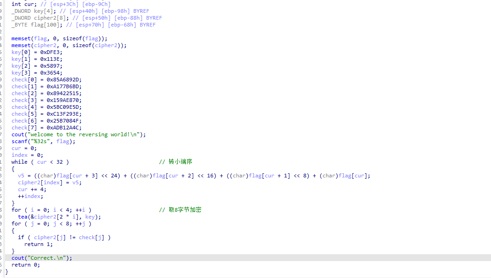

# TPCTF-2025 re 中档题

## RE4

改完花指令看主函数得到：



```python
import struct


def decrypt_tea(v, key):
    # 模拟 32 位无符号整数
    v6, v5 = v[0], v[1]

    # -1640531527 的 32 位无符号表示即为 0x9E3779B9 (TEA 魔术常量)
    delta = 0x9E3779B9
    # 32 轮加密，初始 sum 为 delta * 32
    sum_ = (delta * 32) & 0xFFFFFFFF

    for i in range(32):
        # 逆向求解 v5
        temp1 = (key[3] + (v6 >> 5)) & 0xFFFFFFFF
        temp2 = (sum_ + v6) & 0xFFFFFFFF
        temp3 = (key[2] + ((v6 << 4) & 0xFFFFFFFF)) & 0xFFFFFFFF
        v5 = (v5 - (temp1 ^ temp2 ^ temp3)) & 0xFFFFFFFF

        # 逆向求解 v6
        temp1 = (key[1] + (v5 >> 5)) & 0xFFFFFFFF
        temp2 = (sum_ + v5) & 0xFFFFFFFF
        temp3 = (key[0] + ((v5 << 4) & 0xFFFFFFFF)) & 0xFFFFFFFF
        v6 = (v6 - (temp1 ^ temp2 ^ temp3)) & 0xFFFFFFFF

        # 逆推 sum
        sum_ = (sum_ - delta) & 0xFFFFFFFF

    return v6, v5


if __name__ == '__main__':
    # 提取的密钥
    key = [0xDFE3, 0x113E, 0x5897, 0x3654]

    # 提取的密文 (check 数组)
    check = [
        0x85A6892D, 0xA177B6BD,
        0x89422515, 0x159AE870,
        0x5BC09E5D, 0xC13F293E,
        0x25B7084F, 0xADB12A4C
    ]

    flag = b''
    # 每次处理 2 个 32位整数 (对应 8 个字节)
    for i in range(0, 8, 2):
        v = [check[i], check[i + 1]]
        decrypted_v = decrypt_tea(v, key)

        # 使用 struct 库按照小端序 ('<I') 重新打包为 bytes
        flag += struct.pack('<I', decrypted_v[0])
        flag += struct.pack('<I', decrypted_v[1])

    print("解密成功！Flag为:")
    print(flag.decode('utf-8'))
```

5分钟速溶

## chase TPCTF{DO_YOU_L1KE_PLAYIN9_6@M3S_ON_YOUR_N3S}

NES工程吗，要用FCEUX进行调试吧

直接打开，定位过关条件并修改


得到pt1

pt3用PPU Viewer（图像处理单元查看器）可以看到

pt2比较逆天，需要猜测也是在内存里面只不过不会加载到屏幕上，由于每段flag开头都会有THE FLAG PT我们搜索这几个字符的tile 34 28 25


由于是pt2 结尾肯定是"_" ->3D 

让ai写出映射脚本就好
```python
import binascii

data = "262C21270030340ED200262F3200392F35002933000112A4000118302C2139D12ED93DD6202DD3333D"

data = binascii.a2b_hex(data)

table = {}
str_1 = ord("A")
for i in range(0x21,0x3B):
    table[i] = chr(str_1)
    str_1 += 1
table[0x20] = "@"
table[0] = " "
table[0x3d] = "_"
str_1 = ord("0")
for i in range(0xD0,0xDA):
    table[i] = chr(str_1)
    str_1 += 1
flag = ""

for i in range(len(data)):
    for key,value in table.items():
        if data[i] == key:
            flag += value
print(flag)
```

## portable

file命令发现是MBR硬件程序，所以我们要使用`binwalk`去看两眼


可以看见一个PE一个ELF还有底下一堆压缩包，压缩包我之后查了说是APE的东西，当时没看出来啥用就略过了

```python
f = open("portable_ef3c5f3a7155c5a4c6f0b08606dea575","rb").read()
exe_data=  f[0x9C000:]
open("dump","wb").write(exe_data)


exe_data=  f[0x10000:]
open("dump.exe","wb").write(exe_data)

```

dump出来文件后用ida打开，不知道为什么PE文件找不到东西（XREF cannot find）

用ida打开elf后找半天啥也没有采用字符串大法hh找到了这一段


尝试直接xor一次之后居然直接得到结果了

```python
data =[     0x34, 0x2A, 0x42, 0x0E, 0x00, 0x1D, 0x5C, 0x33, 0x5E, 0x44, 
  0x3E, 0x1A, 0x0B, 0x5C, 0x2C, 0x3A, 0x5F, 0x22, 0x03, 0x28, 
  0x36, 0x1B, 0x07, 0x31, 0x8D, 0xDE, 0x10, 0xA2, 0xEB, 0xB2, 
  0xDA, 0xA2, 0xD8, 0x18, 0x0D, 0x17, 0x1C, 0x1F, 0xBD, 0xD9, 
  0x1D, 0xBF, 0xEB, 0xA2, 0xD8, 0x16, 0x0D, 0xA0, 0xF6, 0x30, 
  0xBD, 0xD8, 0x17, 0xBE, 0xDA, 0x0F, 0xAB, 0xC1, 0xAE, 0xEA, 
  0x8D, 0xDE, 0x11, 0x01, 0xA1, 0xC5
]

flag = []
print(len(data))
key = b"Cosmopolitan"
for i in range(66):
    flag.append(data[i]^key[i%12])
flag = b"TPCTF{"+bytes(flag)+b"}"


print(flag.decode())
```

TPCTF{wE1com3_70_tH3_W0RlD_of_αcτµαlly_pδrταblε_εxεcµταblε}

